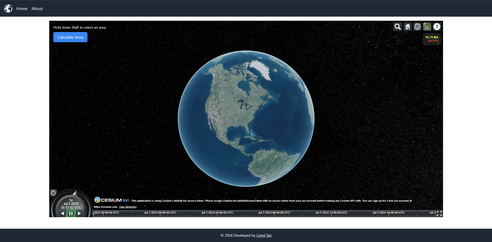

<h1 align="center">
  <br>
   Cesium Angular App
   
   
   
   
</h1>

<p align="center">
  <a href="#ℹ%EF%B8%8F-introduction">Introduction</a> •
  <a href="#features">Features</a> •
  <a href="#installation-guide">Installation Guide</a> •
  <a href="#screenshots">Screenshots</a> •
  <a href="#credits">Credits</a> •
  <a href="#license">License</a> •
  <a href="#contributors">Contributors</a> 
</p>

<div align="center">


</div>

## ℹ️ Introduction

A simple Angular application that allows users to draw a rectangle and calculate the area of the drawn rectangle on [Cesium](https://cesium.com/)


>[!Note] 
  You can check the screenshots below


## ⚡Features

- A home page that displays a map              
- A method to draw a rectangle on the map     
- A button to calculate the area of the rectangle


## 💾Installation Guide
 
 To clone and run this application, you'll need [Git](https://git-scm.com) and [Node.js](https://nodejs.org/en/download/) (which comes with [npm](http://npmjs.com))    installed on your computer. 
 
 ```bash
 # Clone this repository
 $ git clone https://github.com/Ctere1/cesium-angular-app
 # Go into the repository
 $ cd cesium-angular-app
 # Install dependencies
 $ npm install
 ```

 > For running the app:
 ```bash
 # Go into the repository
 $ cd cesium-angular-app
 # Run `ng serve` for a dev server
 $ ng serve
 ```

After these steps navigate to `http://localhost:4200/`. The application will automatically reload if you change any of the source files.
 
 > [!Warning]  
   This application is using Cesium's default ion access token. Please see the [cesium account section](https://cesium.com/)


## 🪟Screenshots

  

  

  


## 📝Credits

This software uses the following packages:

- [Tailwindcss](https://tailwindcss.com/)
- [Angular](https://angular.dev/)
- [Cesium](https://cesium.com/)


## ©License


[LICENSE](./LICENSE)

## 📌Contributors

<a href="https://github.com/Ctere1/">
  
</a>